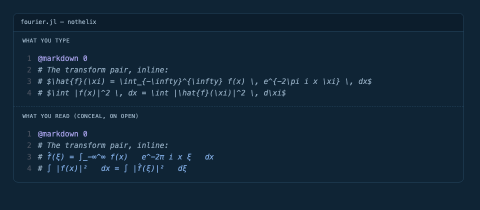

# Nothelix

Nothelix puts notebooks inside Helix. Cells run against a live Julia kernel, plots and typeset equations render inline in the buffer, and the notebook on disk stays a plain `.jl` file that diffs like source.



One buffer, twice. The top pane is the LaTeX you typed. The bottom is what you read a moment later, once concealment has swapped each construct for its Unicode form. The file on disk still holds the LaTeX, and it comes back on the line you are editing.

The block below is not a transcription. `just gallery` writes it straight out of the rendering engine, from the same fixture the snapshot tests pin, so this README cannot drift from what the buffer draws.

<!-- gallery:conceal-fourier -->
```text
# ## The Fourier transform
#
# The forward transform is f̂(ξ) = ∫_-∞^∞ f(x)   e^-2π i x ξ   dx
# and the inverse is f(x) = ∫_-∞^∞ f̂(ξ)   e^2π i x ξ   dξ.
#
# Parseval's theorem states ∫ |f(x)|²   dx = ∫ |f̂(ξ)|²   dξ, so the
# transform preserves energy: ‖f‖₂ = ‖f̂‖₂ for every f ∈ L²(ℝ).
```
<!-- /gallery -->

## What you get

- **Notebooks that behave like source.** A notebook is Julia with `@cell` markers. It diffs, greps, and edits with the motions you already use, and `:convert-notebook` and `:sync-to-ipynb` move it to and from `.ipynb` when a collaborator needs that.
- **Results where the cell is.** Text output, plots, Markdown tables, and display equations render in the buffer. No browser and no second pane. `<space>ny` puts a cell's output on the system clipboard. A `wavplay` call plays through the system output without blocking the cell, drawing a braille waveform under the cell with a playhead you can seek and scrub, and `<space>ns` replays it. A run can call `nothelix_slider` or `nothelix_choice` to drop a live knob under the cell that writes straight back to the kernel and stales whatever reads it, and any Julia library can project its own objects as those knobs by defining a single `nothelix_towidget` method.
- **A kernel that stays warm.** One kernel per notebook, keyed to the file path. State persists across cells the way it does in a REPL, survives closing the buffer and restarting Helix, and runs in the notebook's own directory so relative paths to your data resolve.
- **Math that reads like math.** Inline `$…$` LaTeX conceals to Unicode as you read. Display `$$…$$` blocks and pipe tables compile through Typst and draw as typeset images.
- **One command to hand it over.** `:export-markdown`, `:export-typst`, and `:export-pdf` produce Markdown, a Typst source file, or a finished PDF. No LaTeX distribution required.

## A notebook is a Julia file

```julia
using Plots

@cell 0 :julia
x = 1:10
y = x.^2

@markdown 1 # Results

@cell 2 :julia
plot(x, y)
```

The markers are no-op macros the kernel defines, so `julia notebook.jl` still runs the file. Type `@cell` and press space and the marker is stamped with the next index for you. On save, indices compact back to a contiguous run.

## Install

macOS on Apple Silicon, or Linux on x86_64.

```bash
curl -sSL https://raw.githubusercontent.com/koalazub/nothelix/main/install.sh | sh
```

Then open the bundled demo.

```bash
nothelix
```

You also need Julia 1.9 or newer on your PATH, via [juliaup](https://julialang.org/install/) if you do not have it, and a Kitty-protocol terminal for inline plots and typeset math. Run `nothelix doctor` if anything looks wrong.

## When notebooks get big


`<space>nj` opens the navigator. Every cell shows as index, kind, and label, with a live preview. Type a number to jump, or press `/` to fuzzy-search the labels. Labels come from a marker comment first, then Apple's on-device model if you opt in on macOS 26 or newer, then the cell's first meaningful line. A seventy-cell tutorial reads like a table of contents.

Cell errors get the same treatment. A failure never hands you a bare stacktrace. When a cell fails on an undefined symbol, nothelix scans the sibling cells, finds where that symbol is assigned, and names the cell to run first, so the fix is one cell away instead of a search.

<!-- gallery:error-undefined-variable -->
```text
error[E004]: `A` is not defined
  --> cell 5, line 1
   |
  1 | vals, vecs = eigen(A)
   | ^^^^^^^^^^^^^^^^^^^^^
   |
   = `A` is defined in @cell 2 (Build A) — run @cell 2 first, or run every cell above this one
```
<!-- /gallery -->

`MethodError` is handled the same way, listing the in-scope variables whose types match the failing signature so you can see which argument is wrong.

## Status

Julia is the only supported kernel today. Python is planned. Inline rendering needs the [Helix fork](https://github.com/koalazub/helix/tree/feature/inline-image-rendering) and a Kitty-protocol terminal. On stock Helix, or under tmux or Zellij, images fall back to text placeholders while Unicode math keeps working. Sixel is not implemented. Prebuilt binaries ship for macOS arm64 and Linux x86_64. Where something is unfinished, the docs say so.

## Documentation

Everything lives at [koalazub.github.io/nothelix](https://koalazub.github.io/nothelix). [Installation](https://koalazub.github.io/nothelix/install) covers requirements, the `nothelix` CLI, and building from source. [Notebooks](https://koalazub.github.io/nothelix/notebooks) walks the write, run, and navigate loop. [Rendering](https://koalazub.github.io/nothelix/rendering) explains how figures, math, and exports reach you, and the [Playground](https://koalazub.github.io/nothelix/playground) lets you try the rendering in a browser first. [Commands and keys](https://koalazub.github.io/nothelix/commands) is the reference, [Language server](https://koalazub.github.io/nothelix/lsp) wires up Julia code intelligence, [Architecture](https://koalazub.github.io/nothelix/architecture) explains how the four layers fit together, and [Troubleshooting](https://koalazub.github.io/nothelix/troubleshooting) starts with `nothelix doctor`.

## Credits

Nothelix is a thin layer of glue over a great deal of excellent open-source work, and would not exist without any of it.

- [Helix](https://helix-editor.com/) and [Steel](https://github.com/mattwparas/steel), the editor it lives in and the embedded Scheme the plugin is written in. A [small fork of Helix](https://github.com/koalazub/helix/tree/feature/inline-image-rendering) adds the inline-image rendering everything visual depends on.
- [Julia](https://julialang.org/) and [juliaup](https://github.com/JuliaLang/juliaup), the kernel language and the supported way to install it.
- [Typst](https://typst.app/) and [MiTeX](https://github.com/mitex-rs/mitex), the typesetting system behind math rendering and export, and the LaTeX-to-Typst conversion that feeds it.
- [resvg](https://github.com/RazrFalcon/resvg) and [tiny-skia](https://github.com/RazrFalcon/tiny-skia) rasterise the typeset output. The [image](https://github.com/image-rs/image) crate, [serde](https://serde.rs/), [comrak](https://github.com/kivikakk/comrak), and [rayon](https://github.com/rayon-rs/rayon) do the rest of the system-shaped work in the Rust library.
- The [Kitty graphics protocol](https://sw.kovidgoyal.net/kitty/graphics-protocol/) carries images into the buffer.
- [JETLS](https://github.com/aviatesk/JETLS), [LanguageServer.jl](https://github.com/julia-vscode/LanguageServer.jl), and [Runic](https://github.com/fredrikekre/Runic.jl) provide optional Julia code intelligence and formatting.
- These docs are built with [just-the-docs](https://just-the-docs.com/).
- Prior art that shaped the approach. [Marimo](https://marimo.io/) for notebooks as source files, and [euporie](https://github.com/joouha/euporie) and SymPy's pretty-printer for mathematics in a terminal.

The [credits page](https://koalazub.github.io/nothelix/credits) names each project and explains in full why it is used.

## Licence

MIT
