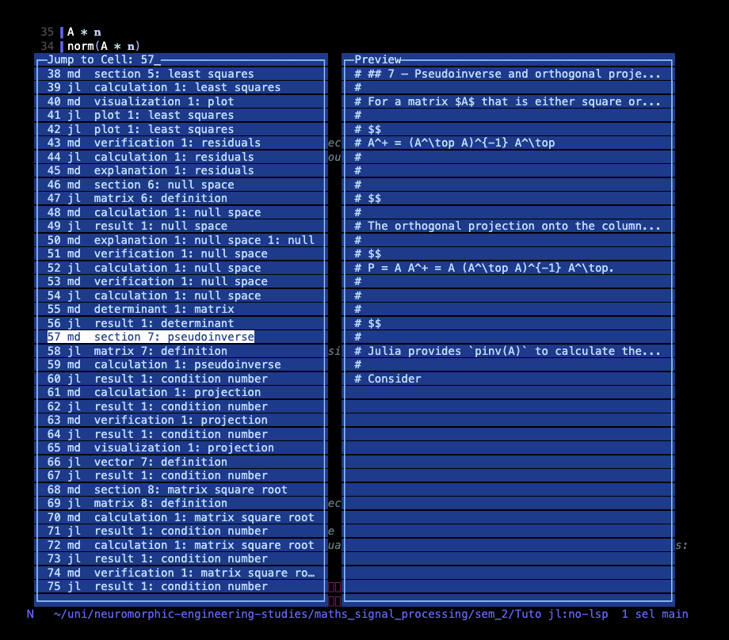

# Notebooks

A nothelix notebook is ordinary Julia source with cell markers laid over it.
Here is one, cells and all.

```julia
using Plots

@cell 0 :julia
x = 1:10
y = x.^2

@markdown 1 # Results

@cell 2 :julia
plot(x, y)
```

Because the markers are comments, the file stays diffable, editable, and
runnable like any other Julia source. Read [Architecture](architecture.md) for
why the format is a script rather than JSON.

## The cell markers

A cell marker is the line that starts a cell. There are four kinds, and each one
opens a cell that runs until the next marker or the end of the file.

| Marker | Cell kind | What it holds |
|---|---|---|
| `@cell` | code cell | Julia that the kernel runs |
| `@markdown` | markdown cell | Prose written as `#`-prefixed comment lines |
| `@raw` | raw cell | Content that passes through conversion verbatim, never executed and never rendered |
| `@typst` | Typst cell | A Typst source block |

The number after the marker is the cell index. Every marker is a no-op macro
that the kernel defines, so the whole file still runs under `julia notebook.jl`
with the markers doing nothing.

If a file has real code above the first marker, nothelix lifts it into an
implicit preamble cell at index `-1` that runs before everything else. This is
where top-of-file `using` lines live, and it runs first so later cells see the
packages they load. A lone `using NothelixMacros` line is the one exception. It
is dropped rather than run, because that package no longer exists and the kernel
defines the markers itself.

## Marker labels

A marker line can carry a trailing comment, and that comment becomes a
persistent label for the cell. The grammar is a space, then `#`, then the label
text.

```julia
@cell 3 :julia # Day E
@markdown 5 # Q1
```

The `#` is required. `extract_marker_comment` parses the trailing comment off
the marker line, and on export the label is prepended to the cell source so it
lands inside the `.ipynb`. A code cell keeps the label as a leading comment
line, while a markdown, raw, or Typst cell gets it as a `#`-prefixed heading.
Because the label is written into the exported cell source, it survives a
round-trip to `.ipynb` and back.

The label is also the first and highest-priority source for a cell's row label
in the navigator, ahead of the on-device model label and the cell's first
meaningful line. Give a cell a marker label and that is exactly what you see
when you jump between cells.

## Inline annotations

A trailing `#` comment on a line inside a cell can turn that line into a live
widget. The annotation is a plain comment, so the file still runs untouched
under `julia notebook.jl` and a checkout reproduces the knob exactly. Each
annotation names the keys that drive it, and the cell picker marks any cell that
carries one with a `⊞` glyph.

| Annotation | Shape | What it does |
|---|---|---|
| `# @param <lo>:<hi> [step <s>]` | `freq = 440   # @param 220:880 step 10` | Nudge the numeric literal with `]p` / `[p` |
| `# @select a\|b\|c` | `wave = "sin"   # @select sin\|cos\|tan` | Cycle the value with `]s` / `[s`, or choose with `<space>nc` |
| `# @toggle` | `loop = true   # @toggle` | Flip the boolean with `<space>nt` |
| `# @image <path>` | `# @image plot.png` | A plot canvas resized with `<space>n=` / `<space>n-` |

The name a `@select` or `@toggle` rewrites is the assignment's left side, exactly
as `@param` reads it — the comment never repeats the name. A `@select` value
keeps its shape: a quoted string is rewritten with quotes, a bare identifier
without. Every one of these stages downstream staleness and debounces a re-run of
the owning cell, the same path a hand edit takes. `]w` and `[w` walk between all
of them; see [Commands](commands.md) for the full grammar.

## Kernel widgets

A cell can declare a widget from inside its run. Call `nothelix_slider` or
`nothelix_choice` after the variable it drives, and nothelix draws one row under
the cell that manipulates that kernel variable directly.

    # @cell 0
    freq = 440
    nothelix_slider("freq", 220, 880; step=10)

    # @cell 1
    y = freq * 2

Nudge the slider row with `]p` and `[p`, or open its popup with `<space>nc`. Each
nudge assigns `freq` in the kernel and records cell 0 as its fresh writer, so cell
1, which reads `freq`, shows a stale badge until you run it again. Nothing re-runs
on its own. A `nothelix_choice("wave", ["sin", "cos", "tan"])` call declares a
choice row cycled with `]s` and `[s`. Both calls return nothing, so the file
still runs under `julia notebook.jl`, and the rows persist with the cell's output
so a reopen restores them. When the kernel is not running, a nudge says so and
asks you to run the cell first.

## Opening an existing notebook

An `.ipynb` file is JSON, so convert it to a `.jl` first.

```
hx examples/simple.ipynb
```

| Command | What it does |
|---|---|
| `:convert-notebook` | Write a `.jl` companion and open it in place |
| `:sync-to-ipynb` | Push `.jl` edits back into the source `.ipynb` |

`:sync-to-ipynb` rewrites only the cell source and leaves the rest of the JSON
untouched.

## Starting from scratch

```
:new-notebook maths.jl
```

This creates `maths.jl` from a one-cell template and opens it. Grow the file
with autofill instead of typing markers by hand.

| You type | You get |
|---|---|
| `@cell<space>` | The marker stamped with the next index |
| `@md<space>` (or `@mark`, `@markdown`) | A markdown cell |
| `@typst<space>` | A typst cell |
| `<space>nn` | The cell-type picker |

Only these exact words expand, so Julia macros like `@show` or `@time` at the
start of a line stay untouched.

You never type a cell index or `:julia` by hand.

## Running cells

| Command | Key | What it runs |
|---|---|---|
| `:execute-cell` | `<space>nr` | The code cell under the cursor |
| `:execute-all-cells` | | Every code cell, top to bottom |
| `:execute-cells-above` | | Every cell from the top down to the cursor |
| `:cancel-cell` | | Interrupts a running execution |

The first run is slow while Julia precompiles imports. Later runs reuse the warm
kernel, and state persists between cells the way it does in a REPL. Output
appears inline below each cell as execution finishes.

Because the kernel is a persistent REPL, running a single cell reads whatever the
session currently holds. When a cell reads a global whose last value in this
session was written by a cell lower in the document, or by a cell whose current
code no longer assigns it, nothelix appends a note row to that cell's output. The
note reads like `note: A was last assigned by cell 76, below this cell` and warns
you that an earlier out-of-order run may have left the wrong value in scope.
Running the notebook top to bottom writes every global in document order, so a
clean run produces no notes.

## Cell freshness

After each run nothelix classifies every executed cell against the live session
and marks the ones that are no longer trustworthy. A clean top to bottom run
leaves every cell fresh and shows nothing. The states are these.

| State | Meaning | Glyph |
|---|---|---|
| fresh | Every input came from a cell above, unchanged since it ran | none |
| out-of-order | An input was last written by a cell below this one | `↕` |
| stale-input | A writer cell re-ran after this cell last ran | `○` |
| orphan-input | An input has no cell that still assigns it | `∅` |
| edited-since-run | The cell's own source changed after its last run | `✎` |

A non-fresh cell shows a short note on its marker line, such as `uses A from
cell 76, below` or `input A changed in cell 74`. Its output gutter bars render
dimmed through the `ui.virtual.output.stale` theme scope, so a stale result
reads as stale from across the room. The cell navigator adds the same glyph as a
one-column status marker per row, which turns it into a whole-notebook freshness
overview. Style the dimmed scope in your theme to control how faded stale output
looks, and it falls back to the default output style when the theme leaves it
unset.

Run `:cell-state` to print the full provenance for the cell under the cursor,
one line per input naming the variable, its writer cell, and its freshness.

See [Rendering](rendering.md) for how figures and math reach the buffer.

## Output and undo

Text output renders as virtual rows below the cell. It is not buffer text, so it
never enters undo and is never written into the `.jl` file. Editing a cell and
running it is one `u` away from a clean slate, because the run itself leaves
nothing to undo.

Because output is not buffer text, you cannot select it with editor motions.
`<space>ny` (`:copy-cell-output`) puts the cell's output on the system
clipboard instead.

<!-- SCREENSHOT NEEDED: virtual-row text output sitting below a cell, showing output that is not buffer text -->

Output persists per-cell in `~/.local/share/nothelix/`, keyed to the cell and a
hash of its source. Reopening a notebook shows each cell's last output. If you
have edited the source since the last run, that output is stale, so nothelix
leaves it blank until you run the cell again.

Plots still reserve real buffer lines for their height. On a fork build with
tagged-undo support, those reserve-line edits are skipped by undo too, the same
as text. On an older build they still cost one undo step.

### Audio

A cell that calls `wavplay(y, fs)` from `WAV.jl` plays its clip without any
change to your code. Nothelix pre-defines `wavplay` in the kernel, so it writes
the samples to a WAV file and returns straight away instead of blocking the cell
for the length of the sound. The clip plays through the system default output at
the system volume, using the platform's own player (`afplay` on macOS,
`pw-play`, `paplay`, `ffplay`, or `aplay` elsewhere).

Running a cell that produces audio plays it once, right away. A `♪` marker sits
on that cell's row in the navigator while the clip runs. `<space>ns`
(`:play-cell-audio`) replays the cell under the cursor, and `<space>nx`
(`:stop-audio`) stops whatever is playing. Starting a new clip stops the
previous one, so only one plays at a time.

A braille waveform of the clip renders under the cell, drawn from the samples in
the WAV file with a header row that shows the length, the sample rate, and
whether it is mono or stereo. While a clip plays, a playhead column advances
across the waveform once a second, and it clears when the clip stops or ends.

To move around inside a clip, `]a` and `[a` (`:audio-seek-forward` and
`:audio-seek-back`) jump forward and back by the current step and resume from
there. Press them in quick succession and the step grows through the ladder,
from a tenth of a second up to half a minute, so a run of taps covers ground
fast. For a finer touch, `:scrub-audio` (or `<space>ns` on the cell that is
already playing) opens a waveform popup where `h` and `l` move the playhead,
`j` and `k` change the step, `Enter` resumes from the playhead, and `Esc` leaves
playback untouched. The autoplay, waveform height, seek ladder, acceleration
window, and sweep length are all tunable through the display settings in
`.nothelix.conf`.

## Kernel persistence

One kernel runs per notebook, keyed to the file path and not to the buffer.
Close and reopen the file, or restart Helix, and nothelix reattaches to the
running kernel with all state intact. State is lost only on `:kernel-shutdown`,
`:kernel-shutdown-all`, or quitting Helix. Because a kernel outlives the editor,
one can predate the runner a later nothelix installs, so when a reattached kernel
booted before the current runner nothelix flags it in the status line and points
you to `:kernel-shutdown` to upgrade it.

## Resume position

Reopening a notebook returns your cursor to the last cell you worked in. The
position is captured when you run a cell or save the file with `:w`, and it is
restored when you open the notebook. It is stored per-user in
`~/.local/share/nothelix/`, not in the project directory.

## Per-project settings

Drop a `.nothelix.conf` file at a project root. Nothelix reads it when you open
a notebook underneath.

| Key | Effect | Default |
|---|---|---|
| `conceal-on-open` | Auto-conceal on open | `true` |
| `math-font-pt`, `math-color` | Size and colour math images | |
| `table-font-pt` | Size table images | |
| `render-width` | Pin image width | |
| `plots-per-cell` | Cap on stacked plots rendered per cell, from `1` to `256` | `32` |
| `plot-mode` | Force `raster` or `braille` plot rendering, or `auto` to decide from the plotting backend | `auto` |
| `slm-summaries` | Label picker rows with Apple's on-device model (macOS 26+, needs Apple Intelligence, falls back to first-line heuristics) | `false` |
| `widgets` | Enable the `]w`/`[w` widget walk and the shared scrub-style modal; when `false` both no-op and the direct feature keys still work | `true` |
| `julia-bin`, `julia-project` | Pin the Julia binary or environment for cells | PATH `julia` |

`julia-bin` and `julia-project` execute code, so they take effect only after you
trust the directory.

| Command | What it does |
|---|---|
| `:nothelix-trust-project` | Trust the directory and enable its pinned Julia |
| `:nothelix-untrust-project` | Revoke trust |
| `:nothelix-project-trust-status` | Show the current trust state |

## Moving around

| Command | Key | What it does |
|---|---|---|
| `:next-cell` | `]l` | Jump to the next cell |
| `:previous-cell` | `[l` | Jump to the previous cell |
| `:widget-walk-next` | `]w` | Jump to the next widget, naming its keys |
| `:widget-walk-prev` | `[w` | Jump to the previous widget, naming its keys |
| `:cell-picker` | `<space>nj` | Open an interactive cell navigator |
| `:select-cell` | `<space>na` | Select the whole cell, header, code, and output |
| `:select-cell-code` | `<space>ni` | Select only the code |
| `:select-output` | `<space>no` | Select the output block |

## The cell navigator

`<space>nj` opens a two-pane picker. Every cell shows as `index · type · label`,
with a live preview of the selected cell. A right-aligned column shows each cell's
last run time, terse as `12ms` or `1.4s` and blank until it runs, and the cell
running right now shows a small marker in place of its state glyph.



Type a cell number to jump straight to it. Press `/` and fuzzy-search the labels,
where typing `pseudo` narrows to the pseudoinverse cells. Use `j` or `k` or the
arrows to scroll one row, and `h` or `l` to jump several rows at once. Press
`Enter` to go there. The jump distance defaults to ten rows and is set with
`picker-jump` in `.nothelix.conf`.

Row labels come from three sources in order. A marker label wins first, then an
on-device model label, and finally the cell's first meaningful line.

With `slm-summaries = true` in `.nothelix.conf`, rows are labelled by Apple's
on-device model on macOS 26 or newer, which requires Apple Intelligence. Labels
like `section 7: pseudoinverse` or `verification 1: residuals` are generated in
the background the first time a picker opens on a notebook. They are cached by
cell content and recomputed only for cells that changed, so there is no network,
no bundled model, and near-zero steady-state cost. Without the config, or on a
machine without the model, the picker falls back to first-line labels.

## Cell indices

On save, nothelix compacts cell indices to a contiguous `0, 1, 2, …`, cleaning
holes left by deleted or reordered cells. Run `:renumber-cells` to trigger it on
demand.

The full command and keybinding reference lives on the [commands](commands.md)
page.
